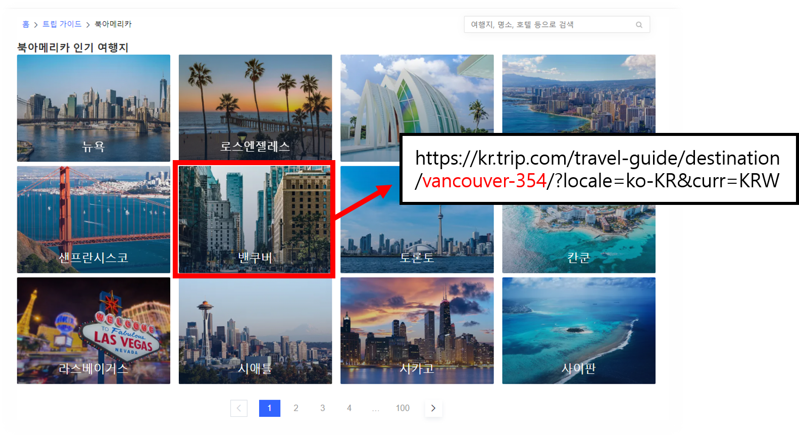
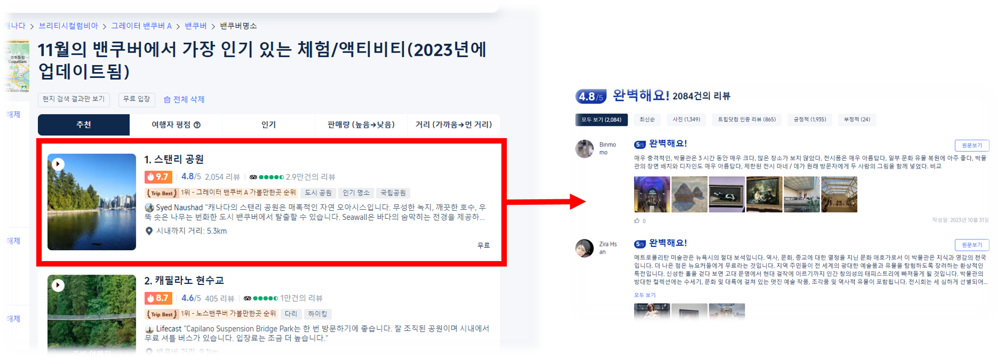
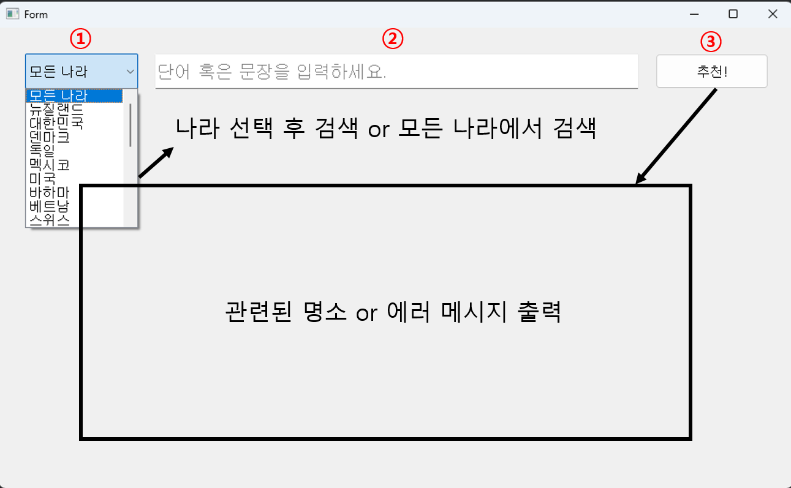
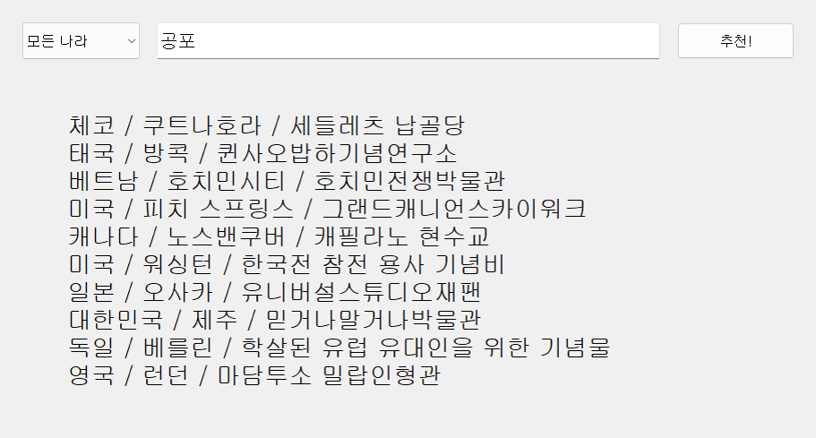
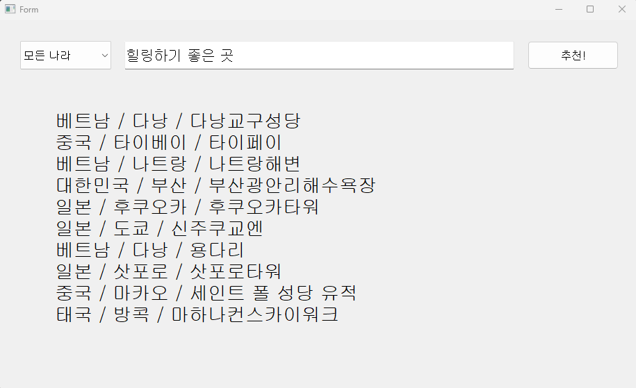

# Trip.com 기반 여행지 추천 시스템

## 1. 프로젝트 목표

사용자가 원하는 여행 스타일을 키워드나 문장으로 입력하면 관련된 여행지를 추천해주는 시스템을 개발한다.

## 2. 개발 기간 및 참여 인원

* 개발 기간: 2023.11.01. ~ 2023.11.03.
* 참여 인원: 4인
* 역할 분담
  * 윤희승 - 데이터 크롤링, 데이터 정합, 모델 학습
  * 최명수 - 데이터 크롤링, 데이터 전처리, 어플리케이션 제작
  * 이영호 - 데이터 크롤링, word cloud
  * 이성찬 - 데이터 크롤링, 모델 예측

## 3. 기술 스택 및 개발 환경

* 개발 언어: Python
* 개발 환경: Window 11, PyCharm IDE, Anaconda venv(Python 3.7)
* 기술 스택: Tensorflow, Keras, PyQt

[requirements.txt](./requirements.txt)

## 4. [핵심 기능](trip.com_기반_여행지_추천_시스템.pdf)(pdf 파일)

### 1. 데이터 크롤링

아시아, 북아메리카, 유럽, 남아메리카, 아프리카, 오세아니아 6개 대륙의 도시별 명소의 리뷰를 수집

1. Selenium 모듈에서 ChromeDriver 설치([1_install_Chrome_driver](1_install_Chrome_driver.py))
2. 각 대륙별 리스트에서 도시의 고유 번호를 저장([2_crawl_website_address_fragments_for_cities](2_crawl_website_address_fragments_for_cities.py))
   - e.g. 북아메리카의 도시 리스트([website_address_fragments_for_cities](./crawling_data/website_address_fragments_for_cities.txt))
   

3. 각 도시별 명소 url을 csv 파일로 저장([3-1_crawl_website_addresses_for_landmarks](3-1_crawl_website_addresses_for_landmarks.py))
   - e.g. 북아메리카의 각 도시별 명소 url([distinct_website_addresses_for_landmarks](./crawling_data/distinct_website_addresses_for_landmarks.txt))
4. 각 명소 url로 접속하여 리뷰 크롤링([4_crawl_reviews](4_crawl_reviews.py)) 


```python
a_elements = driver.find_elements(By.CLASS_NAME, 'element xpath, css_selector, tag_name, class_name...')
time.sleep(2)

# web page에서 요소를 보여주기까지 대기하기 위해 time.sleep을 사용하던 방식에서
# while True, try, except 방식을 사용하여 성능 향상 

while True:  # infinite loop for a elements loading
    a_elements = driver.find_elements(By.CLASS_NAME, 'element xpath, css_selector, tag_name, class_name...')
    try:
        country = a_elements[3].text
    except NoSuchElementException:
        continue
    break
```

### 2. 데이터 전처리

1. Okt 모듈을 사용해서 형태소로 분리하여 (형태소, 품사) 쌍으로 리스트에 저장([5_review_to_morphemes](5_review_to_morphemes.py))

```python
for review_concat in tqdm(review_concats,desc='형태소로 분리 중'):
    div_review_list.append(okt.pos(review_concat, stem=True))
```

2. 의미를 추론할 수 없는 단어 제거(불용어 / 한 글자 / 명사, 동사, 형용사 이외의 단어)([6_refine_morphemes](6_refine_morphemes.py))

3. 중복된 데이터, NaN값을 제거한 후 모든 데이터 정합([7-1_construct_df](7-1_construct_df.py), [7-2_concat_dfs](7-2_concat_dfs.py))

### 3. TFIDF 행렬 생성, Word2Vec 모델 학습

1. 전처리된 리뷰의 단어마다 중요도를 고려하여 가중치를 주기 위해 TFIDF 행렬 구축([9_TFIDF](9_TFIDF.py))
2. Word2Vec 모델 학습([10_Word2Vec](10_Word2Vec.py))
3. 모델 예측([11_landmark_recommendation](11_landmark_recommendation.py))
    - 입력한 keyword와 유사한 단어들을 학습한 Word2Vec 모델로 추출
    - tfidf 행렬과 Word2Vec 모델로 추출한 단어들 간의 코사인 유사도를 측정
    - 코사인 유사도가 높은 순으로 정렬하여 명소 추천

### 4. 어플리케이션

1. 핵심 단어 시각화([8_word_cloud](8_word_cloud.py))
    - e.g. 베트남 호치민시티 벤탄시장
    
2. UI 구현([12_app](12_app.py))

3. 실행 결과


---

Contact: <iyhs1858@gmail.com> 
